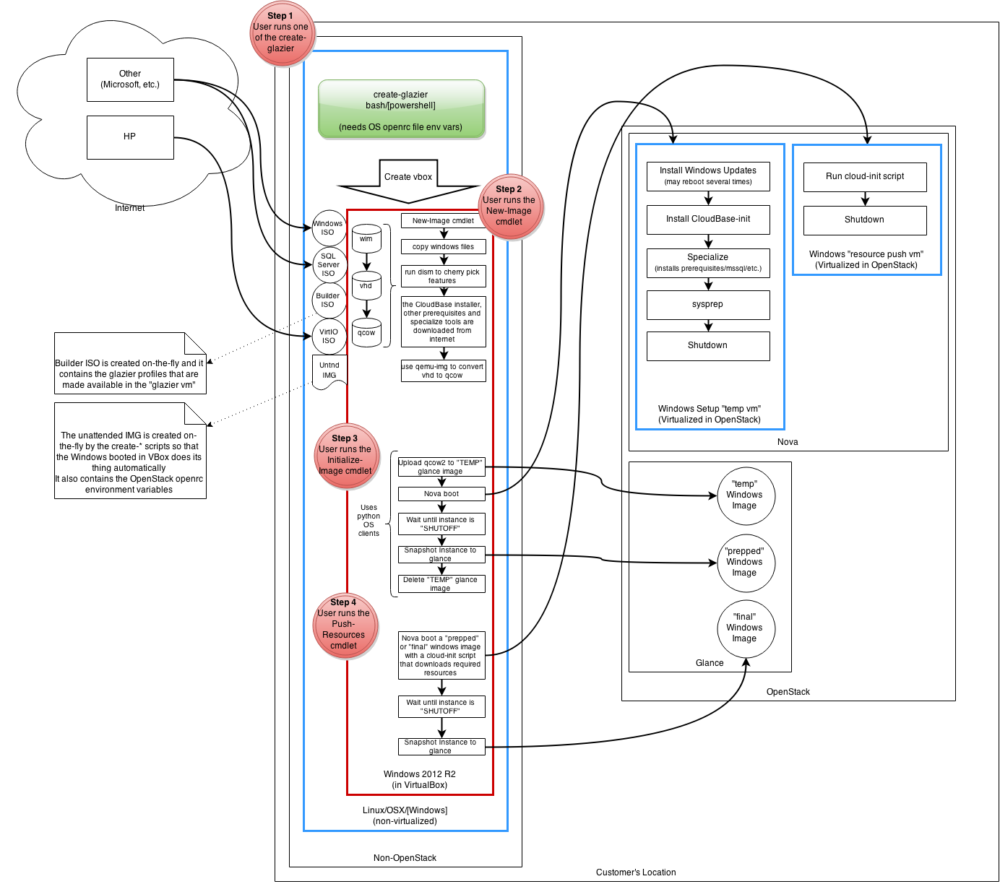

Glazier
===

##Glossary

- `glazier vm` - the virtual machine that runs Windows, booted inside Virtual Box
- `builder.img` - the image that contains all the resources required by the glazier vm to specialize a Windows image
- `temp image` - a glance image that is booted in order to setup windows and specialize the image
- `temp instance` - a nova instance of the `temp image`; it runs the windows setup in unattended mode
- `prepped image` - after `temp image` reaches a shutoff state, it's snapshot in glance is the `prepped image`
- `final image` - the `final image` is a glance snapshot of the `prepped image`, with any additional resources copied over
- `resource push vm` - a nova instance of a `prepped image` or `final image`; it is booted so resources are downloaded on it; it gets snapshot into a `final image`

##Flow



##Glazier profiles

A profile contains all the necessary resources needed to specialize a windows installation. Glazier profiles are made available to the glazier vm through the builder iso.

Directory structure of a glazier profile:

```
.
├── features.csv
├── resources.csv
└── specialize
    ├── specialize.ps1
    └── tools.csv
```

- `features.csv` is a CSV file that contains the desired status of each available windows feature

> Example

```csv
Feature,Core,Standard,Desired
NetFx4ServerFeatures,Enabled,Enabled,Enabled
NetFx4,Enabled,Enabled,Enabled
NetFx4Extended-ASPNET45,Disabled,Disabled,Enabled
MicrosoftWindowsPowerShellRoot,Enabled,Enabled,Enabled
MicrosoftWindowsPowerShell,Enabled,Enabled,Enabled
ServerCore-FullServer,Removed,Enabled,Removed
IIS-LegacySnapIn,Removed,Disabled,Removed
IIS-ManagementScriptingTools,Disabled,Disabled,Removed
IIS-ManagementService,Disabled,Disabled,Removed
IIS-IIS6ManagementCompatibility,Disabled,Disabled,Removed
IIS-Metabase,Disabled,Disabled,Removed
IIS-WMICompatibility,Disabled,Disabled,Removed
IIS-LegacyScripts,Disabled,Disabled,Removed
IIS-FTPServer,Disabled,Disabled,Removed
```

- `resources.csv` is a CSV file that contains a list of resources that will be placed on the final image; each resource is saved to the to `%HOMEDRIVE%`; the directory path is created if it doesn't exist

> Example

```csv
path,uri
\installers\product.zip,http://download.domain.com/product.zip
```

- `tools.csv` is a CSV file containing all required tools so that for your specialize script;
> Example
```csv
name,uri
tool.zip,http://download.domain.com/tool.zip
```

- `specialize.ps1` is a PowerShell script that will run as one of the last steps on the `temp instance`

> Example

```powershell
# Open firewall port 80
New-NetFirewallRule -DisplayName 'Allow HTTP' -Direction Inbound -LocalPort 80 -Protocol TCP -Action Allow
```

##create-glazier

> bash script that needs to work on Linux and OSX (Windows git bash is a nice-to-have)

It generates a `builder.iso` that contains all the specified `glazier profiles` specified in arguments, a CSV file containing all OS_* env vars, and a CSV file with a list of all args passed to create-glazier.

It generates an `unattend.xml` file that installs Windows and runs a script when it's done.

It creates a `glazier vm` by generating a vbox configuration file and boots it using `VBoxManage`. The `glazier vm` will have all ISOs mounted in a predictable order, so the drive letters available in the guest os are consistent each time the `glazier vm` is booted.

###The unattend.xml file

The unattend xml file must do the following:

- Use a product key to activate Windows, if one was specified
- Configure Windows to always run a "shell.ps1" from the builder.img drive as the default shell for windows

###Arguments

- `--windows-iso` - required - path to Windows ISO; image file name is validated to be of the right version and localization (we only support EN-US)
- `--with-sql-server` - optional - can be `none`, `2012` or `2014`; by default, it's `none`
- `--sql-server-iso` - if `--with-sql-server` is specified, this argument is required; it needs to point to a SQL Server ISO that is the correct version
- `--virtio-iso` - required - path to a virtio iso file
- `--profile` - optional - path to a `glazier profile`; the directory needs to have the correct structure; this parameter can be specified multiple times; all the specified profiles will be part of the `builder.iso` and made available to `new-image` in the `glazier vm`
- `--vm-path` - optional - path to a directory where VBox files will be saved; by default, the files will be saved to ~/.glazier
- `--product-key` - required - windows product key used to activate the `glazier vm`

##New-Image

##Initialize-Image

##Push-Resources

> PowerShell commandlet

Push-Resources generates a PowerShell script suitable as a cloud-init script using the `resources.csv` of a `glazier profile`. The cloud init script downloads resources from the internet and saves them to their proper location. It also uses an HTTP(S) proxy if one is provided.

Once the cloud-init script is created, it boots a `prepped image` or a `final image` using nova boot and the generated script as user data. After booting the VM, the command waits until the VM is in a `SHUTOFF` state.

Once the `resource push vm` is shutoff, the command snapshots the VM.

###Arguments

- `-HttpProxy` - optional, specifies an proxy to be used when downloading resources
- `-HttpsProxy` - optional, specifies an proxy to be used when downloading resources
- `-GlazierProfile` - required, specifies a path to a glazier profile whose `resources.csv` will be used to determine the list of items to be downloaded in the `resource push vm`
- `-SourceImageName` - either this or `SourceImageId` must be present; specifies a `prepped image` or `final image` to be booted so resources are downloaded on it
- `-SourceImageId` - either this or `SourceImageName` must be specified; specifies a `prepped image` or `final image` to be booted so resources are downloaded on it
- `-SnapshotImageName` - required; the name of the `final image` that will be snapshot once resources are downloaded and the `resource push vm` is shutoff
